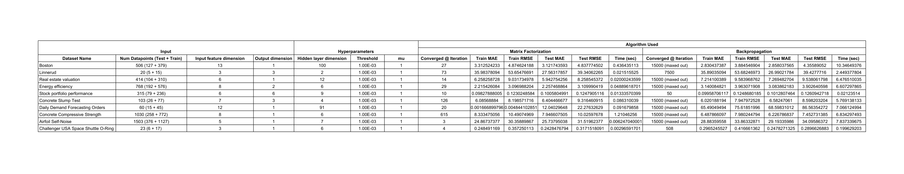
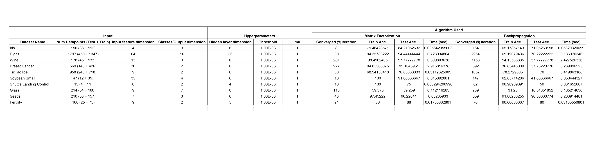

# Training Neural Networks without Backpropagation
--------------------------------------------------------
## Introduction
In this work we propose a matrix factorization based alternative to train neural networks and compare it's performance with backpropagation (the traditional method to train Neural Networks) on the grounds of test/train accuracies, time taken to convergence and epochs run before convergence. We use 10 regression and 10 classification datasets (20 datasets in total) to compare the performance of the two methods on the aforementioned metrics.

-	For technical issues, please report to the [Issues](https://github.com/divyanshu-talwar/Training-NNs-without-Backpropagation/issues) section.

## Dependencies
* Python (3.6.8):
    > cycler==`0.10.0`, decorator==`4.4.0`, matplotlib==`2.1.0`, networkx==`2.4`, numpy==`1.13.3`, Pillow==`6.2.1`, pyparsing==`2.4.2`, python-dateutil==`2.8.0`, pytz==`2019.3`, PyWavelets==`1.1.1`, PyYAML==`5.1.2`, scikit-image==`0.13.0`, scikit-learn==`0.19.1`, scipy==`0.19.1`, six==`1.12.0`, torch==`0.3.1`, torchvision==`0.2.0`

_**Note:** All the aforementioned dependencies can be easily installed by executing the following command:_

`pip install -r requirements.txt`

## Contents
* `scripts/` - contains all the relevant scripts to run the experiment.
	* `scripts/backprop_implementation.py` - implementation of backpropagation based training.
	* `scripts/matrix_factorization_implementation.py` - implementation of our matrix factorization based training.
	* `scripts/read_datasets.py` - contains classes for reading the datasets
	* `scripts/runall.sh` - bash script to run all the experiments mentioned in the paper.
* `datasets` - contains the `classification` and `regression` datasets downloaded from [UCI Machine Learning Repository](https://archive.ics.uci.edu/ml/datasets.php?format=&task=reg&att=num&area=&numAtt=&numIns=greater1000&type=&sort=nameUp&view=table).
* `results/` - contains the training `logs` and loss vs epoch `plots` for both the approaches.

## Results
* Regression datasets:
	{ width=75% }
* Classification datasets:
	{ width=75% }
* Plots:
	* [Backpropagation](https://github.com/divyanshu-talwar/Training-NNs-without-Backpropagation/tree/master/results/backpropagation/plots)
	* [Matrix Factorization](https://github.com/divyanshu-talwar/Training-NNs-without-Backpropagation/tree/master/results/matrix_factorization/plots)
* Training Logs:
	* [Backpropagation](https://github.com/divyanshu-talwar/Training-NNs-without-Backpropagation/tree/master/results/backpropagation/logs)
	* [Matrix Factorization](https://github.com/divyanshu-talwar/Training-NNs-without-Backpropagation/tree/master/results/matrix_factorization/logs)

## Execution
* To run the experiment, first the necessary requirements using the requirements.txt :

`pip install -r requirements.txt`

```
Options :
usage: backprop_implementation.py [-h] [--log_directory LOG_DIRECTORY]
                                  [--log_file LOG_FILE]
                                  [--plot_directory PLOT_DIRECTORY]
                                  [--plot_file PLOT_FILE] [--dataset DATASET]
                                  [--max_epoch MAX_EPOCH]
                                  [--initial_learning_rate INITIAL_LEARNING_RATE]
                                  [--threshold THRESHOLD]
                                  [--hidden_units HIDDEN_UNITS]
                                  [--is_classification IS_CLASSIFICATION]

optional arguments:
  -h, --help                                            # show this help message and exit
  --log_directory log_directory 	                # destination directory to save the training logs
  --log_file LOG_FILE 				        # text filename to save training logs
  --plot_directory PLOT_DIRECTORY                       # destination directory to save the loss vs epoch plots
  --plot_file PLOT_FILE                                 # .png filename to save the loss vs epoch plots
  --dataset DATASET                                     # dataset to run the script on
  --max_epoch MAX_EPOCH                                 # flag to indicate the maximum epochs for training
  --initial_learning_rate INITIAL_LEARNING_RATE         # starting learning rate
  --threshold THRESHOLD                                 # less than threshold value change in subsequent losses implies convergence
  --hidden_units HIDDEN_UNITS                           # number of units in the hidden layer of the neural network
  --is_classification IS_CLASSIFICATION                 # Boolean to indicate if the problem at hand is a classification problem.

usage: matrix_factorization_implementation.py [-h]
                                              [--log_directory LOG_DIRECTORY]
                                              [--log_file LOG_FILE]
                                              [--plot_directory PLOT_DIRECTORY]
                                              [--plot_file PLOT_FILE]
                                              [--dataset DATASET]
                                              [--max_epoch MAX_EPOCH]
                                              [--threshold THRESHOLD]
                                              [--hidden_units HIDDEN_UNITS]
                                              [--is_classification IS_CLASSIFICATION]
                                              [--mu MU]

optional arguments:
  -h, --help                                            # show this help message and exit
  --log_directory log_directory 	                # destination directory to save the training logs
  --log_file LOG_FILE 				        # text filename to save training logs
  --plot_directory PLOT_DIRECTORY                       # destination directory to save the loss vs epoch plots
  --plot_file PLOT_FILE                                 # .png filename to save the loss vs epoch plots
  --dataset DATASET                                     # dataset to run the script on
  --max_epoch MAX_EPOCH                                 # flag to indicate the maximum epochs for training
  --threshold THRESHOLD                                 # less than threshold value change in subsequent losses implies convergence
  --hidden_units HIDDEN_UNITS                           # number of units in the hidden layer of the neural network
  --is_classification IS_CLASSIFICATION                 # Boolean to indicate if the problem at hand is a classification problem.
  --mu MU                                               # hyper-parameter value

```
_**Note:** If you use any other dataset apart from the ones in here add the dataset to the datasets folder, write it's corresponding loader in `read_datasets.py` and run either/both the scripts by using the following command:_

`python <scipt-name> --dataset <dataset_name> --is_classification {True, False}`

* To run all the experiments and to reproduce the results simply execute `scripts/runall.sh` by using the following command:
```bash
bash runall.sh
```